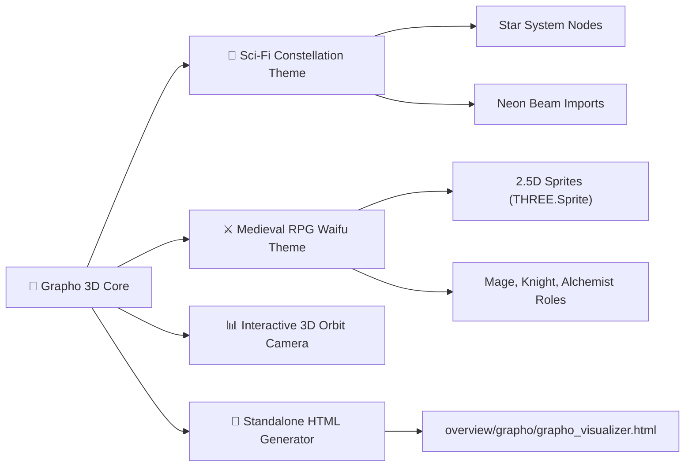

# 🎨 Grapho 3D Visualizer Skill Matrix & Directives

> **Skill Transversal de Visualización 3D/2.5D Interactivas para Grafos de Código**  
> Renderiza mapas interactivos en Three.js con temas Sci-Fi Constellation y Medieval RPG Waifus.

---

## 🎯 Capacidades de la Habilidad

---

## ⚡ Comandos Expuestos

- `$grapho3d`: Genera el visualizador usando el tema por defecto (Sci-Fi Constellation).
- `$grapho3d:scifi`: Genera el mapa 3D con tema de Constelación Neón / Galaxia de código.
- `$grapho3d:rpg`: Genera el mapa 2.5D con tema Medieval RPG Waifus (Sprites Three.js).
